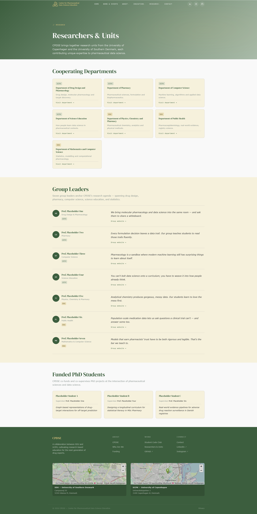
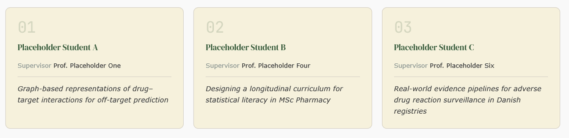
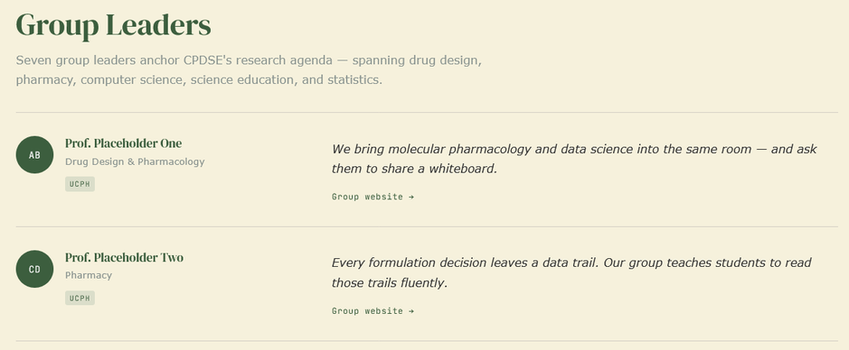
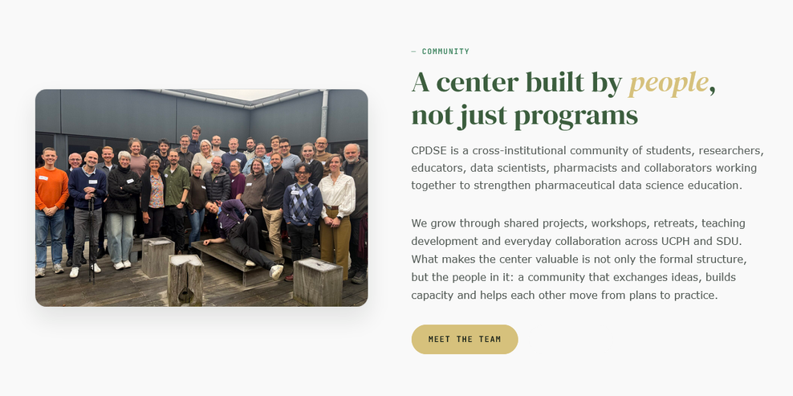

# CPDSE Website Guide

Website design & how to update content.

---

## Hero

The hero is the top area of each page. It has a gradient and subtle pattern in the background.


To update the hero content, look for the following lines in the `.md` file of the page you want to edit:

```yaml
---
layout: sectioned-page        # name of the layout file
title: Page Title             # the big headline
hero_label: Research          # small label above the headline
description: Descriptive text shown below the title.
permalink: /your-url/         # what comes after cpdse.dk/
---
```

---

## Content sections

The content below the hero is divided into sections. Each section has a separate background colour. Usually **Soft White** (`#F9F9F9`) and **Ivory Gold Tint** (`#F6F1DC`) are used in alternating order, beginning with Soft White. Highlight sections use **Forest Green** (`#3C5E3E`).



There are different types of standard content: single column, two-column, cards, and image + text. Individual solutions can also be implemented in HTML.

To work with the standard elements, open the `.md` file of the page you want to edit and add a `sections:` list. Each item in the list is one section.

**Every section can have:**

```yaml
sections:
  - color: soft-white          # soft-white | ivory | forest-green
    title: Section Headline
    intro: Lead paragraph shown beneath the title in a smaller, muted style.
```

---

### Stats banner

A row of large numbers with labels — counts up animatedly when scrolled into view. Works best on a `forest-green` section.

```yaml
  - color: forest-green
    stats:
      - number: 60
        suffix: "+"
        label: People
      - number: 7
        label: Departments
      - number: 2
        label: Universities
      - number: 1
        label: Mission
```

`suffix` is optional — use it for `+`, `%`, `×`, etc.

---

### Single column

Standard single column layout. Text is always left-aligned.

```yaml
  - color: soft-white
    title: Our Approach
    intro: Optional lead sentence.
    content: |
      Regular paragraph text here. Supports **bold**, *italic*,
      [links](https://example.com), and bullet lists.

      - Item one
      - Item two
```

If Markdown formatting is not enough, custom HTML can be included in the `content:` block.

---

### Cards

Cards always have rounded corners. They can be arranged in 2 or 3 columns.



```yaml
  - color: ivory
    title: What we offer
    intro: Optional lead sentence.
    card_columns: 2            # 2 | 3
    card_color: soft-white     # soft-white | ivory
    cards:
      - title: First Card
        content: Body text for the first card.
      - title: Second Card
        content: Body text for the second card.
```

---

### Two columns

A two-column layout, for example to place two blocks of text side by side.



```yaml
  - color: soft-white
    title: Two perspectives
    columns:
      - content: |
          **At UCPH** we focus on drug design and formulation.
      - content: |
          **At SDU** we work on epidemiology and statistics.
```

---

### Image + text

Places an image alongside a block of text. The image can go on the left or right.



```yaml
  - color: soft-white
    title: The team
    image:
      src: /assets/images/team.jpg
      alt: CPDSE team photo
      position: right          # left | right
    content: |
      We are a cross-institutional group of researchers,
      educators, and data scientists.
```

---

## Update Danish pharma snapshot

The About section visualization reads from `assets/data/pharma_snapshot.json`.

To regenerate that snapshot from Medstat download files, run:

```powershell
powershell -ExecutionPolicy Bypass -File scripts/update-pharma-snapshot.ps1
```

Optional parameters:

```powershell
powershell -ExecutionPolicy Bypass -File scripts/update-pharma-snapshot.ps1 -OutputPath "assets/data/pharma_snapshot.json" -MaxLookbackYears 8
```
